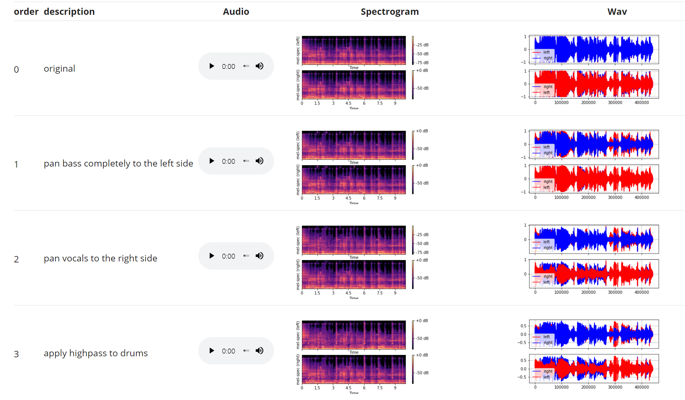
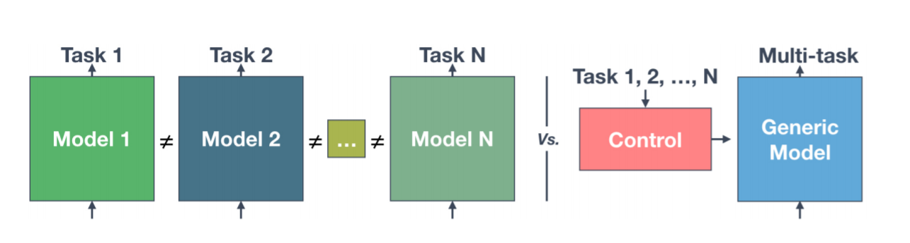

## Contents

1. Introduction  

2. Frequency Transformation for Dedicated Source Separation

3. Selected Publications

    1. **[Source Separation]** 2020
    2. [**Conditioned Source Separation**] 2021 : [](https://paperswithcode.com/sota/music-source-separation-on-musdb18?p=lasaft-latent-source-attentive-frequency)
    3. [**Audio Manipulation with Textual Queries** 2021]

---

## Timeline

1. Source Separation: mix => vocals, 2019~2020
2. Source Separation conditioned on an input symbol, 2020
3. Audio Manipulation conditioned on a Textual Query, 2021

---

  


- Woosung Choi, Minseok Kim, Marco A. Martínez Ramírez, Jaehwa Chung, and Soonyoung Jung "[AMSS-Net](http://intelligence.korea.ac.kr/demo/): Audio Manipulation on User-Specified Sources with Textual Queries"

---

## 1. Source Separation: mix => vocals, 2019~2020

Choi, Woosung, et al. "Investigating u-nets with various intermediate blocks for spectrogram-based singing voice separation." 21th International Society for Music Information Retrieval Conference, ISMIR, Ed. 2020.

1. **review**: a U-Net for Spectrogram-based Singing Voice Separation
2. **motivation**: Spectrogram $\neq$ Image
     - What's wrong with CNNs and spectrograms for audio processing?
     - Alternatives: 1-D CNNs, Dilated CNNs, FTBs, ...
3. **solution:** Frequency Transformation Blocks
     - Employing Fully-Connected (FC) Layers to capture Freq-to-Freq Dependencies
     - (empirical results) Injecting FCs, called FTBs,  into a Fully 2-D Conv U-Net significantly improves SDR performance

---

## 1.1. Review: Source Separation

- separates signals of the specific source from a given mixed-signal
  - Music Source Separation, Speech Enhancement, ...

    
    https://source-separation.github.io/tutorial/intro/src_sep_101.html

- Benchmarks
  - [MUSDB18](https://paperswithcode.com/dataset/musdb18)
  - [DNS Challenge (Deep Noise Suppression Challenge)](https://paperswithcode.com/dataset/deep-noise-suppression-2020)
  - [FUSS(Free Universal Sound Separation)](https://paperswithcode.com/dataset/fuss)

---


## 1.1. Spectrogram-based Source Separation

- Audio Equalizer - Eliminate signals with unwanted frequencies


- Spectrogram-based Source Separation
  1. Apply Short-Time Fourier Transform (STFT) on a mixture waveform to obtain the input spectrograms.
  2. Estimate the vocal spectrograms based on these inputs 
  3. Restore the vocal waveform with inverse STFT (iSTFT).

---


## 1.1. Review: U-Net For Spectrogram-based Source Separation

- Naive Assumption
  - Assuimg a spectrogram is a two (left and right) - channeled image
  - Spectrogram-based Source Separation can be viewed as an Image-to-Image Translation
  

---

## 1.1. Review: U-Net For Spectrogram-based Source Separation (2)

- ..., and it works...!
  - Jansson, A., et al. "Singing voice separation with deep U-Net convolutional networks." 18th International Society for Music Information Retrieval Conference. 2017.
  - Takahashi, Naoya, and Yuki Mitsufuji. "Multi-scale multi-band densenets for audio source separation." 2017 IEEE Workshop on Applications of Signal Processing to Audio and Acoustics (WASPAA). IEEE, 2017.

- Recall the assumption of this approach:
  - Assuming a spectrogram is a two (left and right) - channeled image
  - Spectrogram-based Source Separation $\approx$ Image-to-Image Translation
  - (empirical results) Fully 2-D Convs can provide promising results

---

## 1.2. Motivation: Spectrogram $\neq$ Image

- Image


- Spectrogram


---

## 1.2. Motivation: Spectrogram $\neq$ Image

- [What's wrong with CNNs and spectrograms for audio processing?](https://towardsdatascience.com/whats-wrong-with-spectrograms-and-cnns-for-audio-processing-311377d7ccd)
  - The axes of spectrograms do not carry the same meaning
    - ***spatial invariance*** that 2D CNNs provide might not perform as well
  - The spectral properties of sounds are non-local
    - Periodic sounds are typically comprised of a fundamental frequency and a number of **harmonics** which are spaced apart by relationships dictated by the source of the sound. It is the mixture of these harmonics that determines the timbre of the sound.
  

---

## 1.2. Motivation: Harmonics and Timbre

- Harmonics
  -  

- Timbre of 'Singing Voice' - decided by resonance patterns

  - 

---

## 1.3. Proposed Method: Frequency Transformation Blocks

- Time-Distributed Fully-Connected Layer ([TDF](https://lightsaft.github.io/slide/gaudio/#17))
- Building Block TFC-TDF: Densely connected 2-d Conv (TFC) with TDFs

  

- U-Net with TFC-TDFs

     + 

---

## 1.3. Results?

- Ablation (n_fft = 2048)
  - U-Net with 17 TFC blocks: SDR 6.89dB
  - U-Net with 17 TFC-**TDF** blocks: SDR 7.12dB (+0.23 dB)

- Large Model (n_fft = 4096)


---

## 1.3. Why does it work?: Weight visualization

- freq patterns of different sources captured by TDFs, of FTBs

 

---

## 1.3. ISMIR 2020


---

## 2. Source Separation conditioned on an input symbol, 2020

  - **review**: Conditioned-U-Net (C-U-Net) for Conditioned Source Separation
    - 
  - **motivation**: Extending FTB to Conditioned Source Separation
    - Naive Extention: Injecting FTBs into C-U-Net?
    - (emprical results) It works, but ...
  - **solution:** Latent Instrumant Attentive Frequency Transformation  Block (LaSAFT)
  - **how to modulate latent features**: more complex manipulation method than FiLM

---

## 2.1. Review:  C-U-Net

- Conditioned-U-Net extends the U-Net by exploiting Feature-wise Linear Modulation (FiLM)

  

- Meseguer-Brocal, Gabriel, and Geoffroy Peeters. "CONDITIONED-U-NET: INTRODUCING A CONTROL MECHANISM IN THE U-NET FOR MULTIPLE SOURCE SEPARATIONS." Proceedings of the 20th International Society for Music Information Retrieval Conference. 2019.
  
---
## 2.1. Review:  C-U-Net using  Feature-wise Linear Modulation

  

---

## 2.2. Motivation: Injecting TDFs into C-U-Net?

- Naive Extention: baseline C-U-Net + TDFs

  

- Results
  

---

## 2.2. Motivation: Naive Extention was above our expectation

- TFC vs TFC-TDF
  

- Although it does improve SDR performance by capturing common frequency patterns observed across all instruments,
  - Merely injecting an FTB to a CUNet **does not inherit the spirit of FTBs**

- We propose the Latent Source-Attentive Frequency Transformation (LaSAFT), a novel frequency transformation block that can capture instrument-dependent frequency patterns by exploiting the scaled dot-product attention

---


## 2.2. Motivation: Latent Source

- Extending TDF to the Multi-Source Task
  - Naive Extension: MUX-like approach
    - A TDF for each instrument: $\mathcal{I}$ instrument => $\mathcal{I}$ TDFs
    

  - However, there are much more 'instruments' we have to consider in fact
    - female-classic-soprano, male-jazz-baritone ... $\in$ 'vocals' 
    - kick, snare, rimshot, hat(closed), tom-tom ... $\in$ 'drums'
    - contrabass, electronic, walking bass piano (boogie woogie) ... $\in$ 'bass'  

---

## 2.3. Latent Source-attentive Frequency Transformation

- We assume that there are  $\mathcal{I}_L$ latent instruemtns
  - string-finger-low_freq
  - string-bow-low_freq
  - brass-high-solo
  - percussive-high
  - ...
- We assume each instrument can be represented as a weighted average of them
  - bass: 0.7 string-finger-low_freq + 0.2 string-bow-low_freq + 0.1 percussive-low

- LaSAFT
  - $\mathcal{I}_L$ TDFs for  $\mathcal{I}_L$ latent instruemtns
  - attention-based weighted average


---

## 2.3. LaSAFT: Extending TDF to the Multi-Source Task 

- Conceptual View of LaSAFT
  - Suppose there are $\mathcal{I}$ instruments in the dataset
  - We use $\mathcal{I}_{L}$ TDFs, where $\mathcal{I}_{L}>\mathcal{I}$
  - For the condition vector $C$, we attentively aggregate the results of TDFS.

- Effects of employing LaSAFTs instead of TFC-TDFs

  

---

## 2.4. GPoCM: more complex manipulation method than FiLM

- FiLM (left) vs PoCM (right)

 

- PoCM is an extension of FiLM. 
  - while FiLM does not have inter-channel operations
  - PoCM has inter-channel operations

---


## Experimental Results


---

## LaSAFT + GPoCM

- achieved [state-of-the-art](https://paperswithcode.com/sota/music-source-separation-on-musdb18?p=lasaft-latent-source-attentive-frequency) SDR performance on vocals and other tasks in Musdb18.


- news: outdated :(

---

## 3. Audio Manipulation with Textual Queries

- AMSS-Net: Audio Manipulation on User-Specified Sources with Textual Queries
  - Submitted to ACMMM 2021
  - demo: http://intelligence.korea.ac.kr/demo/


    ```python
    model.manipulate_track(audio, 'decrease the volume of bass') 
    model.manipulate_track(audio, 'pan vocals completely to the left side') 
    model.manipulate_track(audio, 'apply heavy lowpass to drums, vocals') 
    model.manipulate_track(audio, 'apply medium highpass to vocals, drums') # == apply highpass to drums, vocals 
    model.manipulate_track(audio, 'separate vocals, bass, drums') # == extract vocals, drums, bass
    model.manipulate_track(audio, 'mute bass, drums')  # == get rid of drums, bass
    model.manipulate_track(audio, 'remove reverb from drums, bass') 
    ```